# Báo cáo LAB 17 — Data Pipeline Engineering

**Họ tên:** Nguyễn Hoài Nam  
**Lớp:** AICB-P2T2  
**Ngày:** 17/08/2026

---

## 0 · Kết quả `make verify`

Output ba lượt chạy

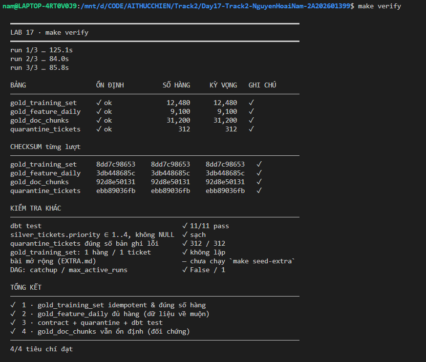

---

## 1 · `gold_training_set` tăng hàng sau mỗi lần chạy

| Nội dung           | Phân tích                                                                                                                                                                                                                                                                                                                                                                                                                                                                                                                                                                                                      |
| ------------------ | -------------------------------------------------------------------------------------------------------------------------------------------------------------------------------------------------------------------------------------------------------------------------------------------------------------------------------------------------------------------------------------------------------------------------------------------------------------------------------------------------------------------------------------------------------------------------------------------------------------- |
| **Triệu chứng**    | Sau khi chạy lại cùng pipeline, số hàng của `gold_training_set` tiếp tục tăng. Bảng nguồn `silver_tickets` vẫn giữ grain một hàng cho một `ticket_id`, nhưng bảng đích xuất hiện nhiều hàng cho cùng một `ticket_id`.                                                                                                                                                                                                                                                                                                                                                                                          |
| **Nguyên nhân**    | Model được materialize theo kiểu `incremental` nhưng ban đầu không khai báo `unique_key` và `incremental_strategy`. Khi không có khóa để đối chiếu, dbt ghi thêm kết quả incremental vào bảng đích thay vì cập nhật hàng đã tồn tại. Retry hoặc chạy lại cùng ngày vì thế nhân bản dữ liệu. Ngoài ra, nguồn CDC có bản ghi `op='u'`: một ticket được tạo ở ngày D1 và cập nhật ở D2 sẽ đi qua bộ lọc `run_date` ở hai ngày khác nhau ngay trong một lượt replay. Vì grain của Gold là entity chứ không phải event, append hoặc chỉ xóa partition ngày đều không giải quyết đúng trường hợp cập nhật chéo ngày. |
| **Cách khắc phục** | Trong `dbt/models/gold/gold_training_set.sql`, đặt `unique_key='ticket_id'` và `incremental_strategy='merge'`, đồng thời giữ nguyên bộ lọc theo `run_date`. Bản ghi mới được insert, còn bản ghi có cùng `ticket_id` được update. Trong `dags/ai_training_pipeline.py`, đặt `catchup=False` và `max_active_runs=1` để hạn chế chạy bù ngoài ý muốn và tránh nhiều DAG run cùng ghi vào warehouse. Hai tham số DAG chỉ giảm khả năng kích hoạt lỗi; tính idempotent vẫn phải được bảo đảm tại model.                                                                                                            |
| **Bằng chứng**     | Số hàng lượt đầu trước khi sửa: 13790· lượt chạy lại trước khi sửa: 26270· sau khi sửa: 12480· số `ticket_id` duy nhất: 12480 · checksum ba lượt: 8622572a97.                                                                                                                                                                                                                                                                                                                                                                                                                                                  |

### Evidence

Số hàng lượt đầu trước khi sửa

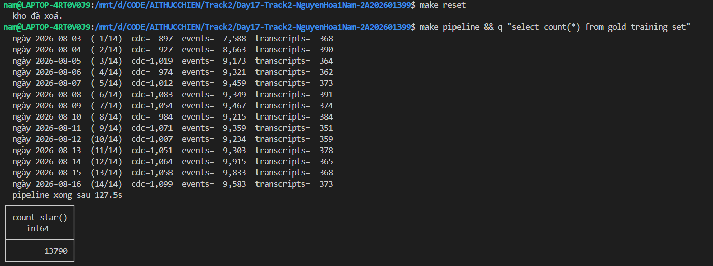

Số hàng lượt chạy lại trước khi sửa

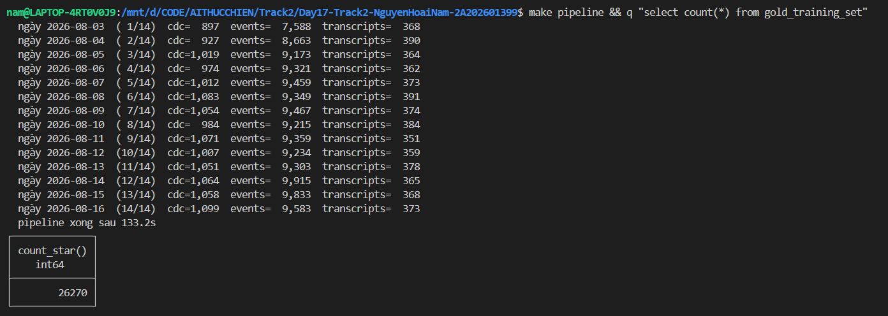

Make verify trước khi sửa

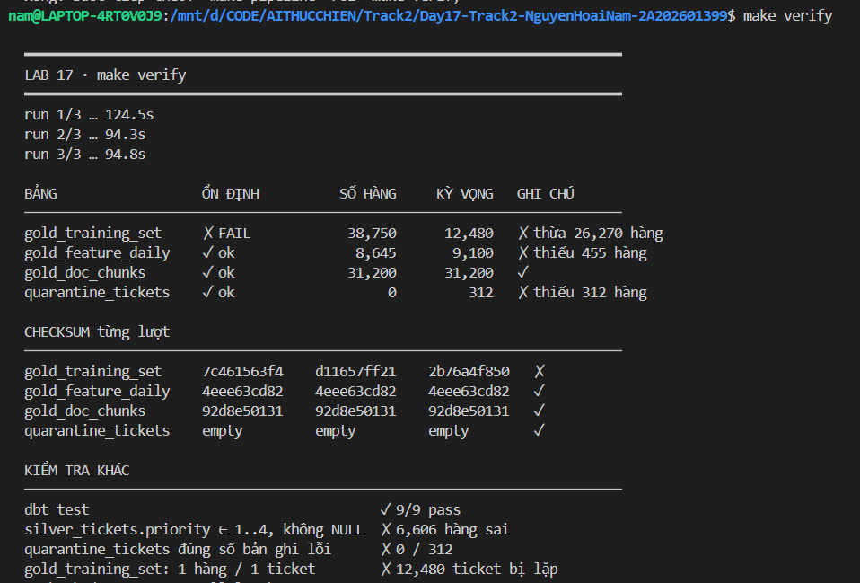

Make verify sau khi sửa

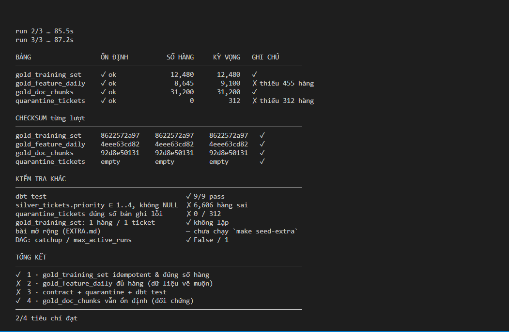

### Kết luận nhiệm vụ 1

Grain của bảng là một entity ticket và natural key là `ticket_id`. Khi thiếu
`unique_key`, dbt không biết hàng nào cần được ghi đè nên hành vi incremental trở
thành ghi thêm. `merge` theo `ticket_id` làm thao tác ghi idempotent: chạy lại
cùng input vẫn tạo ra cùng trạng thái đích.

---

## 2 · `gold_feature_daily` thiếu hàng ở các ngày quá khứ

| Nội dung                              | Phân tích                                                                                                                                                                                                                                                                                                                                                                                           |
| ------------------------------------- | --------------------------------------------------------------------------------------------------------------------------------------------------------------------------------------------------------------------------------------------------------------------------------------------------------------------------------------------------------------------------------------------------- |
| **Triệu chứng**                       | `gold_feature_daily` thiếu các cặp `(event_date, customer_id)` đã tồn tại trong `silver_events`. Các cặp thiếu tập trung ở những ngày sự kiện cũ nhưng được ingest vào warehouse muộn hơn.                                                                                                                                                                                                          |
| **P99 độ trễ đo được**                | **2.7258333 ngày** — lấy từ truy vấn percentile trên `bronze_events`.                                                                                                                                                                                                                                                                                                                               |
| **Tỷ lệ event đến muộn hơn một ngày** | **50.5%**.                                                                                                                                                                                                                                                                                                                                                                                          |
| **Lookback đã chọn**                  | **3 ngày** — làm tròn lên từ P99 đo được để các sự kiện đến muộn vẫn nằm trong vùng được tính lại.                                                                                                                                                                                                                                                                                                  |
| **Nguyên nhân**                       | Điều kiện cũ `event_date > (select max(event_date) from {{ this }})` chỉ nhận ngày sự kiện mới hơn ngày lớn nhất đã có ở target. Ví dụ, khi target đã tiến tới ngày D, một event thuộc D−2 nhưng mới được ingest sẽ không thỏa điều kiện và bị bỏ qua vĩnh viễn. Chỉ đổi `>` thành `>=` cũng chưa đủ vì cách đó chỉ tính lại thêm partition tại `max(event_date)`, không bao phủ độ trễ nhiều ngày. |
| **Cách khắc phục**                    | Trong `dbt/models/gold/gold_feature_daily.sql`, dùng điều kiện `event_date >= (select max(event_date) from {{ this }}) - interval 3 day`. Grain gồm hai cột nên khai báo `unique_key=['event_date', 'customer_id']` và `incremental_strategy='merge'`. Khi lookback tính lại cùng một cặp ở nhiều lượt, `merge` thay thế kết quả cũ thay vì cộng dồn bản sao.                                       |
| **Bằng chứng**                        | Trước khi sửa: **8645 hàng** · sau khi sửa: **9100 hàng** · số cặp Silver còn thiếu trong Gold: **455 hàng** · checksum ba lượt: **3db448685c**.                                                                                                                                                                                                                                                    |

### Evidence

Đo phân bố độ trễ của dữ liệu

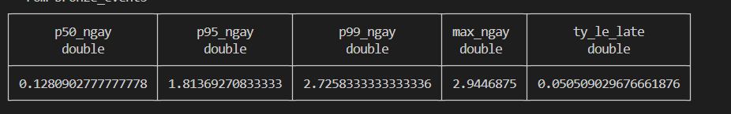

Make verify trước khi sửa

Make verify sau khi sửa

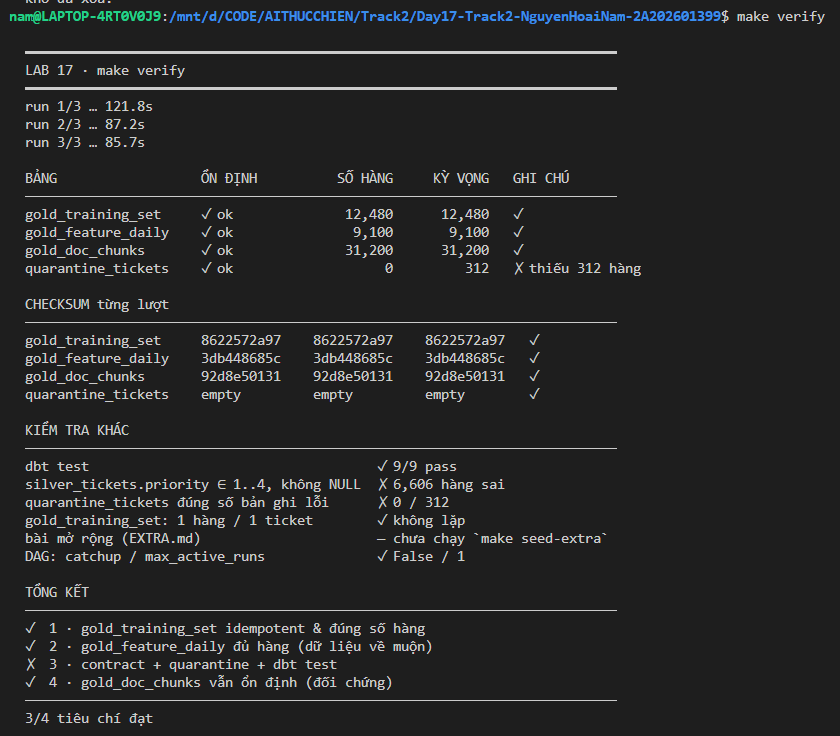

### Vì sao dùng P99 thay vì `max`?

P99 đại diện cho gần như toàn bộ phân bố nhưng ít bị chi phối bởi một outlier đơn
lẻ. Dùng `max` có thể khiến lookback tăng mạnh chỉ vì một bản ghi bất thường.
Mỗi ngày mở rộng window làm pipeline đọc thêm dữ liệu, tính lại thêm nhóm và ghi
thêm qua `merge`; chi phí này lặp lại ở mọi lần chạy sau, không phải chi phí một
lần. Trong bộ dữ liệu của bài, lookback ba ngày được chọn từ P99 và cần được ghi
kèm số đo thực tế ở phần bằng chứng.

---

## 3 · Kiểu biểu diễn cột `priority` thay đổi giữa chu kỳ

| Nội dung            | Phân tích                                                                                                                                                                                                                                                                                                                                                                                                                                                           |
| ------------------- | ------------------------------------------------------------------------------------------------------------------------------------------------------------------------------------------------------------------------------------------------------------------------------------------------------------------------------------------------------------------------------------------------------------------------------------------------------------------- |
| **Triệu chứng**     | `silver_tickets.priority` có nhiều `NULL` và xuất hiện các giá trị ngoài miền contract. Đối chiếu Bronze cho thấy từ giữa chu kỳ source chuyển một phần priority từ chuỗi số sang nhãn chữ, đồng thời vẫn có một nhóm giá trị hỏng thật.                                                                                                                                                                                                                            |
| **Nguyên nhân**     | Logic `try_cast(priority_raw as integer)` không phân biệt schema evolution với dữ liệu lỗi. Nó biến các nhãn hợp lệ `urgent/high/medium/low` thành `NULL`, nhưng lại chấp nhận các chuỗi số ngoài miền như `0`, `5`, `-1`. Nếu xếp hạng CDC trước rồi mới lọc, ticket có bản ghi mới nhất bị lỗi cũng biến mất dù vẫn còn trạng thái hợp lệ trước đó.                                                                                                               |
| **Ba nhóm giá trị** | (1) `'1'..'4'`: giữ nguyên; (2) `urgent/high/medium/low`: map lần lượt về `1/2/3/4`; (3) `P1`, `unknown`, `0`, `5`, `-1`, chuỗi rỗng và `NULL`: chuẩn hóa thành `NULL` và đưa bản ghi CDC vào quarantine.                                                                                                                                                                                                                                                           |
| **Cách khắc phục**  | `dbt/macros/normalize_priority.sql`: dùng một macro `CASE` chung cho mapping và kiểm tra miền. `dbt/models/silver/silver_tickets.sql`: chuẩn hóa, lọc bản ghi lỗi trước, rồi mới `row_number()` để giữ trạng thái hợp lệ gần nhất của ticket. `dbt/models/silver/quarantine_tickets.sql`: lọc các bản ghi mà macro trả về `NULL`. `dbt/models/silver/schema.yml`: bật `contract.enforced: true`, thêm test `not_null` và `accepted_values` với miền `[1, 2, 3, 4]`. |
| **Bằng chứng**      | `silver_tickets` còn **12480 ticket** · số priority sai miền hoặc NULL: **0** · `quarantine_tickets`: **312 hàng** · `dbt test`: **11/11 pass**.                                                                                                                                                                                                                                                                                                                    |

### Evidence

Số ticket còn lại sau khi loại các bản ghi CDC có priority lỗi

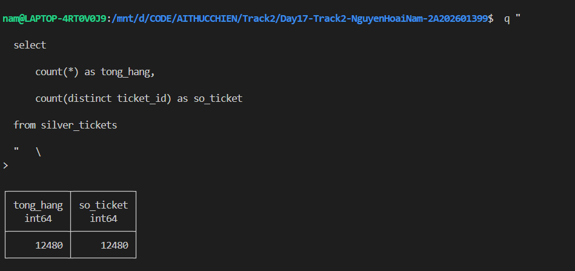

Số priority sai miền hoặc NULL

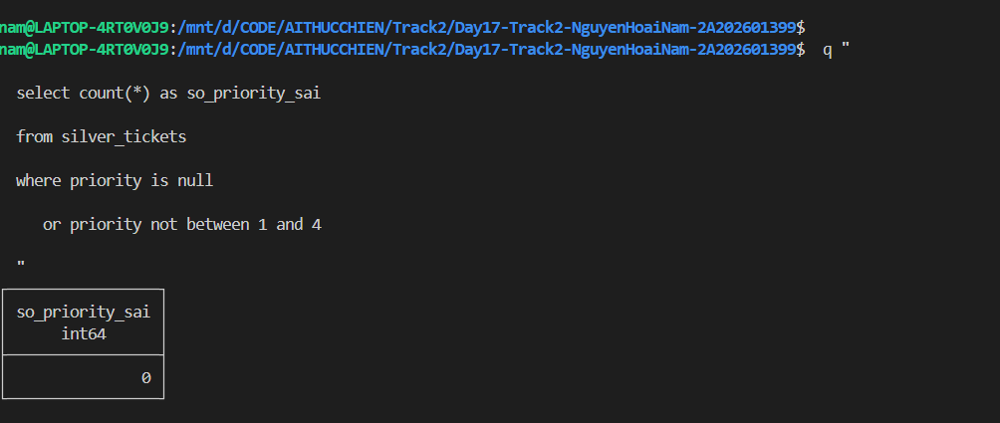

Quarantine_tickets

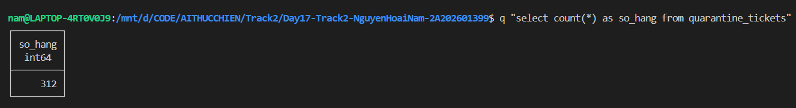

Make verify trước khi sửa

Make verify sau khi sửa

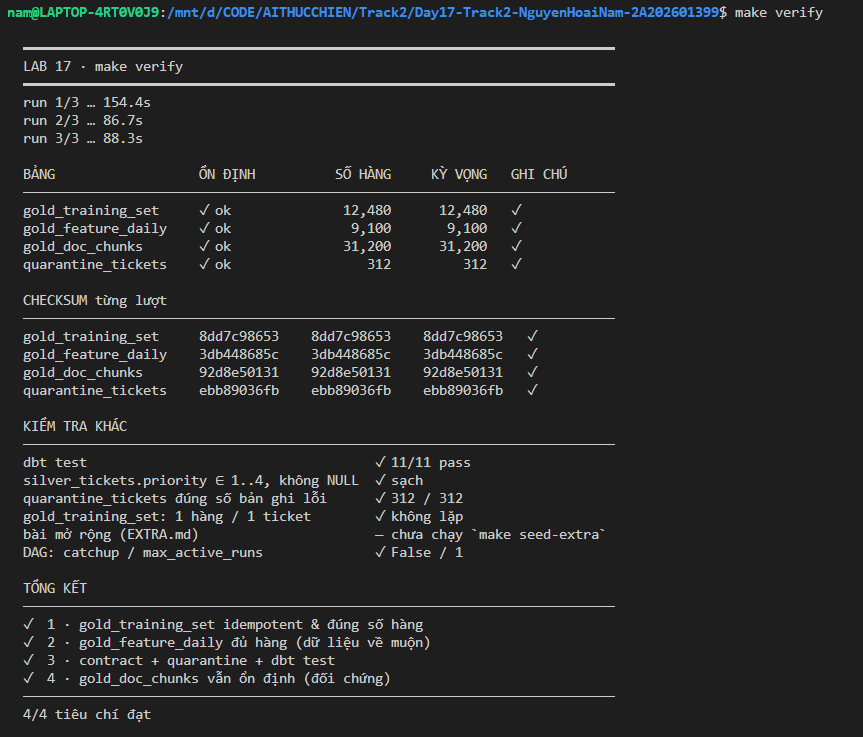

Dbt test

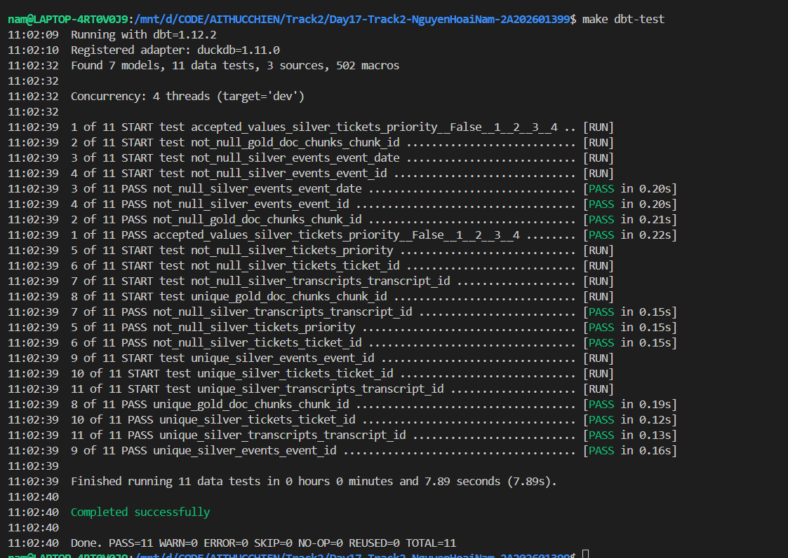

### Quyết định thiết kế

Dữ liệu lỗi nên được giữ nguyên ở Bronze và bị chặn khi đi vào Silver. Bronze là
lớp dữ liệu thô phục vụ audit, điều tra payload source và replay sau khi logic
chuẩn hóa được cập nhật. Nếu từ chối ngay ở Bronze thì bằng chứng gốc bị mất, làm
việc phân tích sự cố và khôi phục dữ liệu khó hơn.

Không nên để một lượng nhỏ bản ghi lỗi làm toàn bộ DAG dừng và chặn các ticket,
event hoặc transcript hợp lệ đang chờ phục vụ. Quarantine cho phép cô lập bản ghi
lỗi để theo dõi và xử lý riêng, trong khi contract và dbt test bảo vệ chất lượng
của Silver. Trong hệ thống thực tế vẫn nên có cảnh báo và ngưỡng tỷ lệ lỗi; chỉ
dừng pipeline khi mức lỗi vượt quá giới hạn vận hành đã thống nhất.

---

## 5 · Tổng kết

| Nhiệm vụ | Khi tiếp nhận một hệ thống chưa quen, tôi sẽ kiểm tra điều này trước tiên                                                                                  |
| -------- | ---------------------------------------------------------------------------------------------------------------------------------------------------------- |
| 1        | Xác định grain, natural key và semantics của incremental write; sau đó kiểm tra retry/rerun có idempotent hay không.                                       |
| 2        | Đo phân bố event-time so với ingestion-time trước khi chọn watermark hoặc lookback window; đồng thời bảo đảm khóa merge đúng grain.                        |
| 3        | So sánh phân bố giá trị thô theo thời gian để phân biệt schema evolution với dữ liệu hỏng; giữ raw data và thiết kế quarantine thay vì làm mất bằng chứng. |

